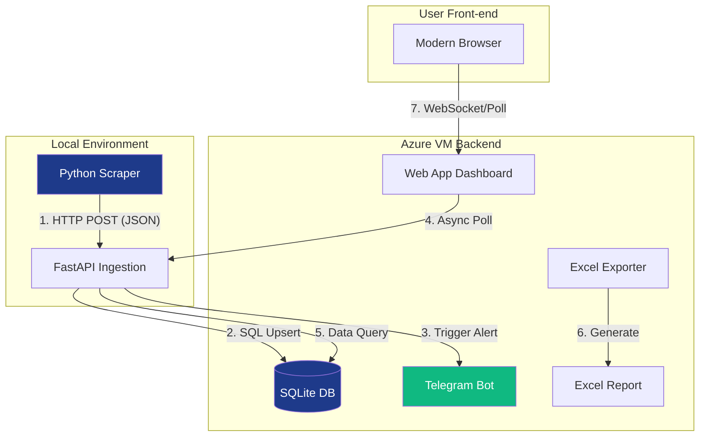

# POCT Group | GeM Tender Dashboard (Azure Backend)

An executive-tier dark mode dashboard designed for persistent tracking, analytics, and status management of medical equipment tenders extracted from the Government e-Marketplace (GeM).

---

## 📄 Software Requirements Specification (SRS)

### 1. Functional Requirements
- **FR1: Data Ingestion API**: Provide a secure `/api/tenders/upload` endpoint for the local scraper to push JSON datasets.
- **FR2: Persistence**: Maintain an absolute source of truth in a SQLite database (`gem_tenders.db`) with support for auto-migrations.
- **FR3: Real-Time Dashboard**: Display bids in a premium dark-mode UI with auto-polling every 35 seconds.
- **FR4: Analytics Engine**: Aggregate data for "Total Bids", "Open", "Submitted", and "Won" metrics across categories (Q-Line, Heidelco, POCT).
- **FR5: Pipeline Tracking**: Allow users to manually update bid status (Open, Submitted, Won, Lost) directly from the row.
- **FR6: Telegram Watchdog**: Monitor the last "Heartbeat" of the scraper. If 12 hours pass without a check-in, send a `[CRITICAL]` alert via Telegram.
- **FR7: Cross-Tab Sync**: Synchronize filter states (Hide Visited, Brand filters) across all open browser tabs using `localStorage` and `storage` events.

### 2. Non-Functional Requirements
- **NFR1: Performance**: Analytics and Dashboard load must be < 500ms using indexed SQLite queries and Pandas aggregation.
- **NFR2: Reliability**: Background watchdog tasks for scraper health must run persistently as `asyncio` tasks.
- **NFR3: Scalability**: Architecture must support hybrid deployment (Cloud Dashboard + Local Scraper).

---

## 🔄 Data Flow Diagram (DFD)



### 📋 Legend & Notation
| Shape | Notation | Description |
| :--- | :--- | :--- |
| **Rectangle** | Process | A functional logic block (e.g., FastAPI, Web App). |
| **Cylinder** | Data Store | The persistent SQLite storage for tenders. |
| **Arrow** | Data Flow | Direction of data movement (e.g., Scraped JSON to DB). |
| **Subgraph** | Boundary | Logical separation between Local machine and Cloud VM. |

---

## 🛠️ Tech Stack
- **Framework**: FastAPI (Python 3.9+)
- **ORM/DB**: SQLAlchemy with SQLite
- **Frontend**: Vanilla JS (ES6+), Jinja2 Templates, Google Inter Font, Feather Icons.
- **Analytics**: Pandas for on-the-fly heavy lifting.
- **Deployment**: Azure VM with Cloudflare Tunneling.

---

## 🚀 Installation & Setup
1. Clone the repository on the VM.
2. Install dependencies: `pip install -r requirements.txt`.
3. Create a `.env` file based on `.env.example` (TELEGRAM_TOKEN, CHAT_ID).
4. Run the server: 
   ```bash
   nohup python3 -m uvicorn web_app:app --host 0.0.0.0 --port 8080 > server_logs.txt 2>&1 &
   ```
